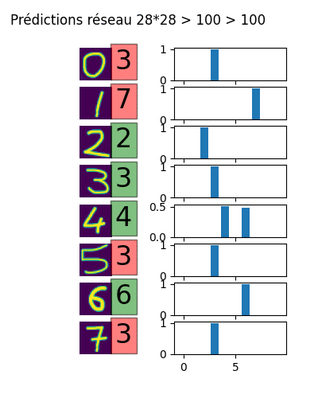

# Tutoriel TensorFlow


Exemples d'architectures de réseaux de neurones construits avec TensorFlow/Keras, tous entraînés sur le dataset **MNIST**.

---

## Contenu

| Fichier | Architecture | Description |
|---|---|---|
| [1.py](1.py) | MLP | Réseau dense avec une ou plusieurs couches cachées |
| [2.py](2.py) | CNN | Réseau de convolution |
| [3-gan.py](3-gan.py) | GAN | Generative Adversarial Network |
| [autoencoder.py](autoencoder.py) | Autoencodeur | Débruitage d'images |

---

## Exemples de résultats

### GAN — génération de chiffres


### Surapprentissage



### Autoencodeur — débruitage


---

## Prérequis

```bash
pip install tensorflow matplotlib
```

## Utilisation

```bash
python 1.py          # MLP
python 2.py          # CNN
python 3-gan.py      # GAN
python autoencoder.py  # Autoencodeur
```
